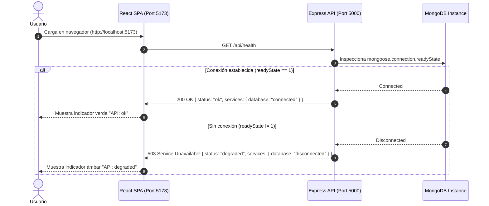

# Arquitectura Técnica del Sistema: DevCoach Sparring

Este documento describe la arquitectura modular, contratos de API, estrategia de persistencia y flujo de datos de DevCoach Sparring conforme avanza su grafo de desarrollo.

---

## 1. Topología del Monorepo

El repositorio está organizado como un monorepo NPM con separación estricta de responsabilidades:

```text
devcoach-sparring/
├── client/                     # Frontend SPA en Vite + React 18 + Tailwind CSS
│   ├── src/
│   │   ├── App.jsx             # Shell principal con monitoreo de API
│   │   ├── main.jsx            # Entry point
│   │   └── index.css           # Estilos base y tokens Tailwind
│   ├── index.html
│   ├── vite.config.js
│   └── package.json
├── server/                     # Backend API en Node.js + Express + Mongoose
│   ├── src/
│   │   ├── app.js              # Configuración de Express, middlewares y rutas
│   │   ├── server.js           # Bootstrap del servidor HTTP y conexión DB
│   │   ├── db.js               # Conexión defensiva a MongoDB
│   │   └── routes/
│   │       └── health.js       # Endpoint de diagnóstico y salud
│   ├── tests/
│   │   └── health.test.js      # Pruebas de integración con Supertest & MongoMemoryServer
│   └── package.json
├── tests/
│   └── e2e/
│       └── smoke.spec.js       # Validación End-to-End con Playwright
├── docs/                       # Documentación técnica y guías
├── tickets/                    # Registro formal de historias de usuario y evidencias
├── playwright.config.js        # Orquestación de webServer y navegadores E2E
└── package.json                # Workspaces de NPM y scripts concurrentes
```

---

## 2. Contratos de API (Endpoints Iniciales)

### `GET /api/health`

Comprueba el estado del servidor y la conectividad activa con MongoDB.

- **Método:** `GET`
- **Ruta:** `/api/health`
- **Headers:** `Accept: application/json`

#### Códigos de Respuesta

| Código HTTP | Escenario | Payload de Ejemplo |
| :--- | :--- | :--- |
| `200 OK` | Servidor en línea y MongoDB conectado | `{"status": "ok", "timestamp": "2026-10-01T02:50:00.000Z", "services": {"database": "connected"}}` |
| `503 Service Unavailable` | Servidor en línea pero MongoDB desconectado / inalcanzable | `{"status": "degraded", "timestamp": "2026-10-01T02:50:00.000Z", "services": {"database": "disconnected"}}` |

---

## 3. Diagramas de Flujo y Arquitectura

### 3.1 Flujo de Arranque y Healthcheck



### 3.2 Harness de Testing y E2E Playwright

```mermaid
graph TD
    A[npm test / npm run test:e2e] --> B[Vitest + Supertest]
    A --> C[Playwright Test Runner]

    subgraph "Backend Harness"
        B --> D[MongoMemoryServer (In-Memory Mongo)]
        B --> E[Express App (Supertest)]
    end

    subgraph "E2E Harness (Playwright)"
        C --> F[Orquesta webServer: server (port 5000)]
        C --> G[Orquesta webServer: client (port 5173)]
        C --> H[Chromium Browser Context]
        H --> G
        G --> F
    end
```

---

## 4. Evolución Hacia las Siguientes Historias

- **US-02:** Introducirá los schemas `Topic` y `SessionLog` en `/server/src/models/`, además del motor puro `srsCalculator.js`.
- **US-03 & US-04:** Conectarán los endpoints de Active Recall y Sparring por voz con el SDK `@google/genai` y la Web Speech API nativa.
