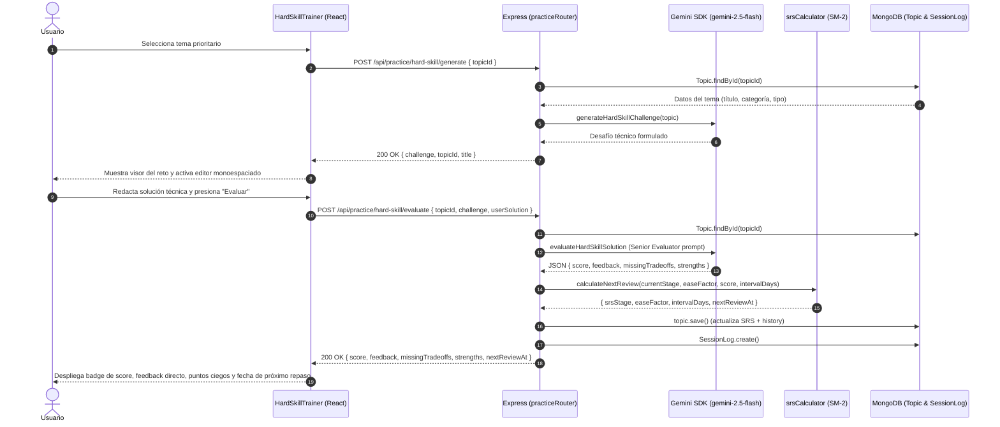
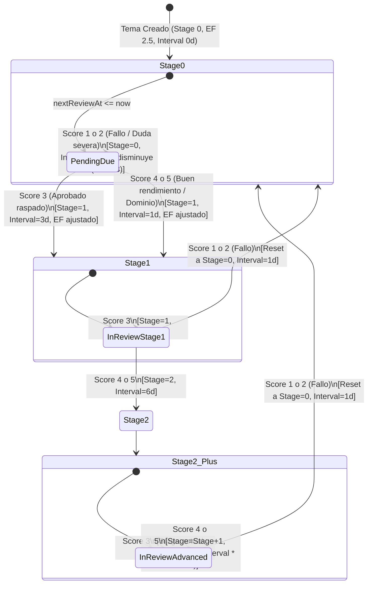
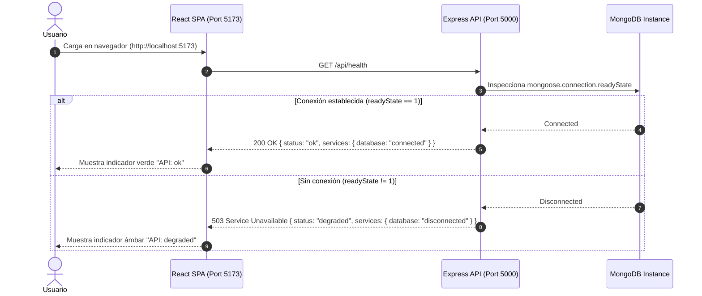
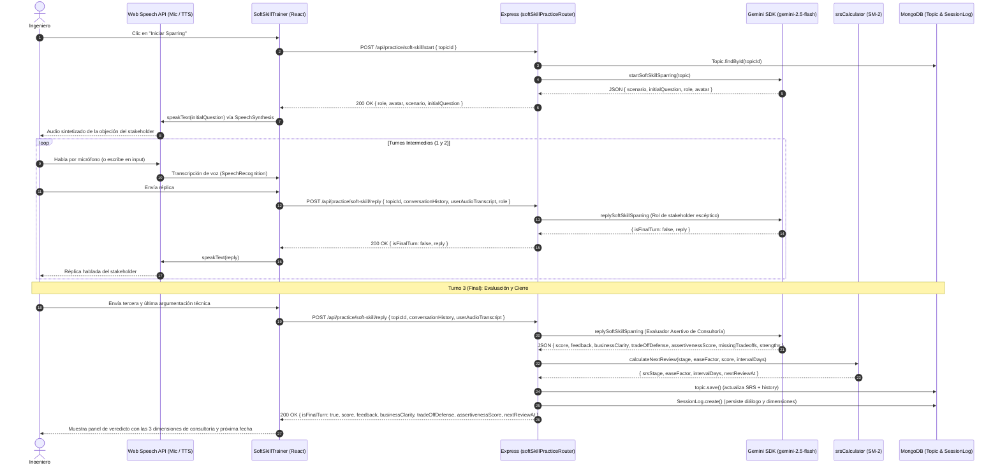
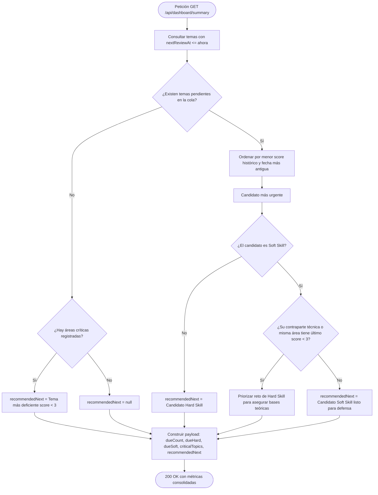
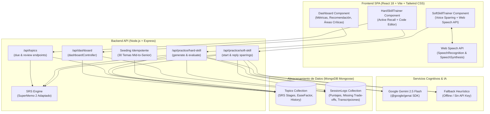
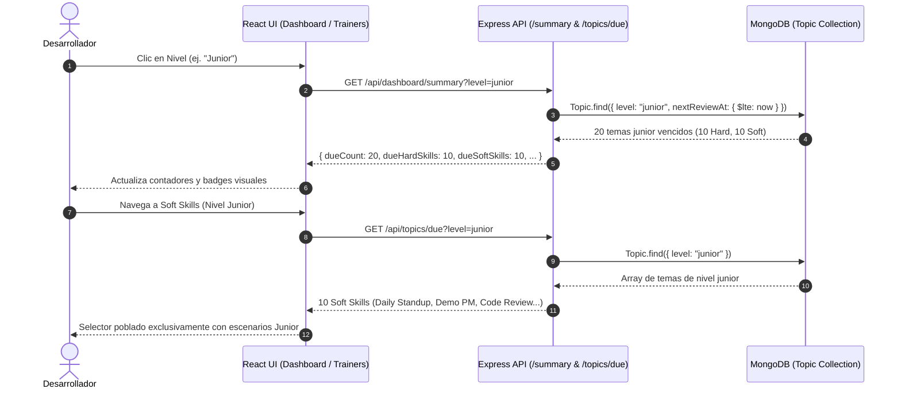

# Arquitectura Técnica del Sistema: DevCoach Sparring

Este documento describe la arquitectura modular, contratos de API, estrategia de persistencia y flujo de datos de DevCoach Sparring conforme avanza su grafo de desarrollo.

---

## 1. Topología del Monorepo

El repositorio está organizado como un monorepo NPM con separación estricta de responsabilidades:

```text
devcoach-sparring/
├── client/                     # Frontend SPA en Vite + React 18 + Tailwind CSS
│   ├── src/
│   │   ├── App.jsx             # Shell principal con monitoreo de API
│   │   ├── main.jsx            # Entry point
│   │   └── index.css           # Estilos base y tokens Tailwind
│   ├── index.html
│   ├── vite.config.js
│   └── package.json
├── server/                     # Backend API en Node.js + Express + Mongoose
│   ├── src/
│   │   ├── app.js              # Configuración de Express, middlewares y rutas
│   │   ├── server.js           # Bootstrap del servidor HTTP y conexión DB
│   │   ├── db.js               # Conexión defensiva a MongoDB
│   │   └── routes/
│   │       └── health.js       # Endpoint de diagnóstico y salud
│   ├── tests/
│   │   └── health.test.js      # Pruebas de integración con Supertest & MongoMemoryServer
│   └── package.json
├── tests/
│   └── e2e/
│       └── smoke.spec.js       # Validación End-to-End con Playwright
├── docs/                       # Documentación técnica y guías
├── tickets/                    # Registro formal de historias de usuario y evidencias
├── playwright.config.js        # Orquestación de webServer y navegadores E2E
└── package.json                # Workspaces de NPM y scripts concurrentes
```

---

## 2. Contratos de API

### 2.1 `GET /api/health`

Comprueba el estado del servidor y la conectividad activa con MongoDB.

- **Método:** `GET`
- **Ruta:** `/api/health`
- **Headers:** `Accept: application/json`

#### Códigos de Respuesta

| Código HTTP | Escenario | Payload de Ejemplo |
| :--- | :--- | :--- |
| `200 OK` | Servidor en línea y MongoDB conectado | `{"status": "ok", "timestamp": "2026-10-01T02:50:00.000Z", "services": {"database": "connected"}}` |
| `503 Service Unavailable` | Servidor en línea pero MongoDB desconectado / inalcanzable | `{"status": "degraded", "timestamp": "2026-10-01T02:50:00.000Z", "services": {"database": "disconnected"}}` |

### 2.2 `GET /api/topics/due`

Obtiene la cola de temas vencidos para repetición espaciada (`nextReviewAt <= Date.now()`), priorizando los temas más críticos (menor promedio histórico de score) y con mayor atraso temporal.

- **Método:** `GET`
- **Ruta:** `/api/topics/due`
- **Headers:** `Accept: application/json`

#### Códigos de Respuesta

| Código HTTP | Escenario | Payload de Ejemplo |
| :--- | :--- | :--- |
| `200 OK` | Consulta exitosa (array de temas) | `[{"_id": "...", "title": "React Fiber", "category": "hard_skill", "type": "theory", "srsStage": 0, "nextReviewAt": "..."}]` |
| `500 Internal Server Error` | Fallo de base de datos | `{"error": "Internal Server Error"}` |

### 2.3 `POST /api/topics/review`

Registra el resultado de una sesión de Active Recall o defensa por voz, recomputa el estado SRS con SM-2 adaptado y persiste el intento en el historial.

- **Método:** `POST`
- **Ruta:** `/api/topics/review`
- **Headers:** `Content-Type: application/json`
- **Body:**
  ```json
  {
    "topicId": "651f8...",
    "score": 4,
    "userInput": "Explicación de Fiber reconciler...",
    "aiFeedback": "Buena argumentación técnica."
  }
  ```

#### Códigos de Respuesta

| Código HTTP | Escenario | Payload de Ejemplo |
| :--- | :--- | :--- |
| `200 OK` | Revisión procesada exitosamente | `{"message": "Review recorded successfully", "topic": {"_id": "...", "title": "React Fiber", "srsStage": 1, "nextReviewAt": "..."}}` |
| `400 Bad Request` | Faltan campos requeridos o inválidos | `{"error": "topicId and a valid score between 1 and 5 are required"}` |
| `404 Not Found` | Topic no encontrado | `{"error": "Topic not found"}` |
| `500 Internal Server Error` | Fallo de base de datos | `{"error": "Internal Server Error"}` |

### 2.4 `POST /api/practice/hard-skill/generate`

Recibe un `topicId`, consulta el tema en MongoDB y formula un reto de Active Recall conceptual o práctico con `@google/genai` (`gemini-2.5-flash`).

- **Método:** `POST`
- **Ruta:** `/api/practice/hard-skill/generate`
- **Headers:** `Content-Type: application/json`
- **Body:**
  ```json
  {
    "topicId": "674c11112222333344445555"
  }
  ```

#### Códigos de Respuesta

| Código HTTP | Escenario | Payload de Ejemplo |
| :--- | :--- | :--- |
| `200 OK` | Reto generado exitosamente | `{"topicId": "...", "title": "Node.js Event Loop", "type": "theory", "category": "hard_skill", "challenge": "¿Cómo previene Node.js el thread starvation en la fase poll...?"}` |
| `400 Bad Request` | Falta `topicId` | `{"error": "topicId is required"}` |
| `404 Not Found` | Topic inexistente | `{"error": "Topic not found"}` |
| `500 Internal Server Error` | Error al invocar IA o BD | `{"error": "Internal Server Error"}` |

### 2.5 `POST /api/practice/hard-skill/evaluate`

Recibe la solución técnica del usuario, la evalúa con un prompt estricto de Senior Evaluator usando Gemini (`gemini-2.5-flash`), actualiza el estado SRS del `Topic` y guarda un registro en `SessionLog`.

- **Método:** `POST`
- **Ruta:** `/api/practice/hard-skill/evaluate`
- **Headers:** `Content-Type: application/json`
- **Body:**
  ```json
  {
    "topicId": "674c11112222333344445555",
    "challenge": "¿Cómo previene Node.js el thread starvation en la fase poll...?",
    "userSolution": "process.nextTick se drena al terminar la operación actual antes de la siguiente fase..."
  }
  ```

#### Códigos de Respuesta

| Código HTTP | Escenario | Payload de Ejemplo |
| :--- | :--- | :--- |
| `200 OK` | Evaluación procesada exitosamente | `{"score": 5, "feedback": "Excelente dominio...", "missingTradeoffs": ["..."], "strengths": ["..."], "nextReviewAt": "2026-10-02T...", "srsStage": 1, "intervalDays": 1, "sessionLogId": "..."}` |
| `400 Bad Request` | Faltan campos requeridos | `{"error": "topicId, challenge, and userSolution are required"}` |
| `404 Not Found` | Topic inexistente | `{"error": "Topic not found"}` |
| `500 Internal Server Error` | Error en evaluación o BD | `{"error": "Internal Server Error"}` |

### 2.6 `POST /api/practice/soft-skill/start`

Inicia el sparring de consultoría asignando un rol de stakeholder (`Tech Lead`, `PM orientado a costos`, `Cliente No Técnico`) y planteando un escenario conflictivo inicial.

- **Método:** `POST`
- **Ruta:** `/api/practice/soft-skill/start`
- **Headers:** `Content-Type: application/json`
- **Body:**
  ```json
  {
    "topicId": "674c11112222333344445555"
  }
  ```

#### Códigos de Respuesta

| Código HTTP | Escenario | Payload de Ejemplo |
| :--- | :--- | :--- |
| `200 OK` | Escenario y rol inicial generados | `{"topicId": "...", "title": "Microservicios", "role": "Tech Lead Escéptico", "avatar": "🛡️", "scenario": "El cliente cuestiona...", "initialQuestion": "¿Por qué necesitamos...?"}` |
| `400 Bad Request` | Falta `topicId` | `{"error": "topicId is required"}` |
| `404 Not Found` | Topic inexistente | `{"error": "Topic not found"}` |
| `500 Internal Server Error` | Error al invocar IA | `{"error": "Internal Server Error"}` |

### 2.7 `POST /api/practice/soft-skill/reply`

Gestiona el flujo conversacional por turnos. Si es turno intermedio (1 o 2), replica con escepticismo. Si es turno final (3), genera el veredicto del Evaluador Asertivo, recalcula SRS y persiste en `SessionLog`.

- **Método:** `POST`
- **Ruta:** `/api/practice/soft-skill/reply`
- **Headers:** `Content-Type: application/json`
- **Body:**
  ```json
  {
    "topicId": "674c11112222333344445555",
    "role": "Tech Lead Escéptico",
    "conversationHistory": [
      { "speaker": "ai", "text": "¿Por qué no usamos SQLite en vez de Postgres?" }
    ],
    "userAudioTranscript": "PostgreSQL nos brinda concurrencia MVCC y extensiones de indexación esenciales para escalar."
  }
  ```

#### Códigos de Respuesta

| Código HTTP | Escenario | Payload de Ejemplo |
| :--- | :--- | :--- |
| `200 OK (Turno Intermedio)` | Réplica del stakeholder | `{"isFinalTurn": false, "role": "Tech Lead Escéptico", "reply": "Entiendo, pero ¿cómo justificas el costo operacional?"}` |
| `200 OK (Turno Final)` | Veredicto con SRS y Mongo | `{"isFinalTurn": true, "score": 4, "feedback": "...", "businessClarity": "...", "tradeOffDefense": "...", "assertivenessScore": 4, "missingTradeoffs": [], "strengths": ["..."], "nextReviewAt": "...", "sessionLogId": "..."}` |
| `400 Bad Request` | Faltan campos requeridos | `{"error": "topicId and userAudioTranscript are required"}` |
| `404 Not Found` | Topic inexistente | `{"error": "Topic not found"}` |
### 2.8 `GET /api/dashboard/summary`

Consolida en un solo payload las métricas operativas del día, conteos de cola SRS, detección de temas con deficiencias y la recomendación inteligente acoplada.

- **Método:** `GET`
- **Ruta:** `/api/dashboard/summary`
- **Headers:** `Accept: application/json`

#### Códigos de Respuesta

| Código HTTP | Escenario | Payload de Ejemplo |
| :--- | :--- | :--- |
| `200 OK` | Métricas y recomendación calculadas exitosamente | `{"dueCount": 3, "dueHardSkills": 2, "dueSoftSkills": 1, "criticalTopics": [{"_id": "...", "title": "React Fiber", "lastScore": 1, "srsStage": 0, "nextReviewAt": "..."}], "recommendedNext": {"_id": "...", "title": "React Fiber", "category": "hard_skill", "type": "theory"}}` |
| `500 Internal Server Error` | Error al consultar la base de datos | `{"error": "Internal Server Error"}` |

---


## 3. Modelo de Datos (Mongoose Schemas)

### Modelo `Topic` (`server/src/models/Topic.js`)

```typescript
interface IReviewHistory {
  score: number;          // 1 a 5
  userInput: string;      // Respuesta o transcripción del usuario
  aiFeedback: string;     // Feedback emitido por Gemini
  reviewedAt: Date;       // Timestamp del repaso
}

interface ITopic {
  title: string;
  category: 'hard_skill' | 'soft_skill';
  type: 'theory' | 'practice';
  srsStage: number;       // Etapa SRS (0: nuevo/reseteado, 1, 2, ...)
  easeFactor: number;     // Multiplicador de dificultad (default: 2.5, min: 1.3)
  intervalDays: number;   // Días hasta el próximo repaso
  nextReviewAt: Date;     // Fecha programada para la siguiente revisión (Indexado)
  history: IReviewHistory[]; // Subdocumentos embebidos
  createdAt: Date;
  updatedAt: Date;
}
```

### Modelo `SessionLog` (`server/src/models/SessionLog.js`)

```typescript
interface ISessionLog {
  topicId: ObjectId;      // Referencia a Topic
  challenge: string;      // Enunciado generado por IA
  userSolution: string;   // Solución técnica del usuario
  score: number;          // Calificación asignada (1 a 5)
  feedback: string;       // Dictamen técnico del Senior Evaluator
  missingTradeoffs: string[]; // Puntos ciegos o trade-offs no considerados
  strengths: string[];    // Fortalezas técnicas identificadas
  reviewedAt: Date;
  createdAt: Date;
  updatedAt: Date;
}
```

---

## 4. Diagramas de Flujo y Arquitectura

### 4.1 Flujo de Active Recall y Evaluación de Hard Skills (Gemini + SRS)




### 4.2 Máquina de Estados del Motor Algorítmico SRS (SM-2 Adaptado)



### 4.3 Flujo de Arranque y Healthcheck



### 4.4 Harness de Testing y E2E Playwright

```mermaid
graph TD
    A[npm test / npm run test:e2e] --> B[Vitest + Supertest]
    A --> C[Playwright Test Runner]

    subgraph "Backend Harness"
        B --> D[MongoMemoryServer (In-Memory Mongo)]
        B --> E[Express App (Supertest)]
    end

    subgraph "E2E Harness (Playwright)"
        C --> F[Orquesta webServer: server (port 5000)]
        C --> G[Orquesta webServer: client (port 5173)]
        C --> H[Chromium Browser Context]
        H --> G
        G --> F
    end
```

### 4.5 Flujo de Sparring por Voz (Web Speech API + Gemini + SRS)



### 4.6 Lógica de Recomendación Acoplada (Hard Skills + Soft Skills)

El backend en `GET /api/dashboard/summary` implementa la heurística pedagógica de acoplamiento: si el tema con fecha más vencida es una defensa por voz (Soft Skill), pero su contraparte técnica (misma subcategoría) tiene calificación deficiente (`score < 3`), se antepone el reto técnico:



### 4.7 Diagrama General del Ecosistema DevCoach Sparring



---

## 5. Evolución del Sistema y Cierre de Historias

- [x] **US-01:** Scaffolding, Base Monorepo y Harness de Tests (Vitest + Playwright).
- [x] **US-02:** Schemas Mongoose y Motor Algorítmico SRS (SM-2 Adaptado).
- [x] **US-03:** Módulo Hard Skills: Active Recall Teórico y Práctico con IA.
- [x] **US-04:** Módulo Soft Skills: Sparring por Voz (Web Speech API + Gemini).
- [x] **US-05:** Dashboard Operativo y Acoplamiento de Habilidades (Cola de Repaso Unificada y visualización integrada).
- [x] **US-06:** Seed Senior del Roadmap (30 temas Mid-to-Senior) y Validación E2E Total.
- [x] **US-07:** Niveles de Progresión y Andamiaje Pedagógico (Scaffolding con Pistas Gemini `/hint`).
- [x] **US-08:** Catálogo Completo Multinivel (Junior/Mid/Senior) de 62 Temas y Sincronización UI Reactiva.

---

## 6. Arquitectura Multinivel y Sincronización UI (US-08)

### 6.1 Modelo de Datos: Campo `level` en `Topic`

El modelo `Topic` (`server/src/models/Topic.js`) categoriza cada tópico en una jerarquía de progresión pedagógica estricta:

```javascript
level: {
  type: String,
  enum: ['junior', 'mid', 'senior'],
  default: 'junior',
  index: true,
}
```

### 6.2 Flujo de Datos y Sincronización de Nivel en la UI



### 6.3 Estrategia de Seeding con `Topic.bulkWrite`

Para garantizar idempotencia y migración transparente de bases de datos preexistentes, `server/src/scripts/seed.js` orquesta un batch `bulkWrite`:

```javascript
const operations = topics.map((t) => ({
  updateOne: {
    filter: { title: t.title },
    update: {
      $set: {
        level: t.level || 'junior',
        category: t.category,
        type: t.type,
      },
      $setOnInsert: {
        srsStage: t.srsStage ?? 0,
        easeFactor: t.easeFactor ?? 2.5,
        intervalDays: t.intervalDays ?? 0,
        nextReviewAt: t.nextReviewAt || new Date(),
        history: t.history || [],
      },
    },
    upsert: true,
  },
}));
```

Esta estrategia asegura que:
1. Nuevos temas se insertan (`upsert: true`).
2. Temas existentes actualizan forzosamente su campo `level` sin sobreescribir el historial de revisiones ni la etapa SRS alcanzada por el usuario.

---

## 7. Cobertura y Resumen de Validación

| Componente / Suite | Herramienta | Conteo de Tests | Estado |
| :--- | :--- | :--- | :--- |
| **Backend Unit & Integration** | Vitest + Supertest + MongoMemoryServer | 54 tests (8 suites) | **100% PASS** |
| **Frontend & End-to-End** | Playwright (Chromium Headless) | 14 tests E2E completos (5 suites) | **100% PASS** |
| **Catálogo Multinivel & Seeding** | Supertest / MongoMemoryServer | 5 tests de verificación de 62 temas y niveles | **100% PASS** |
| **Sincronización de UI y Contadores** | Playwright E2E (`multilevel-catalog.spec.js`) | 2 tests de sincronización y escenarios junior | **100% PASS** |
| **Calidad de Código y Tipos** | ESLint / AST Analysis / Graphify | 0 regresiones detectadas | **Aprobado** |


