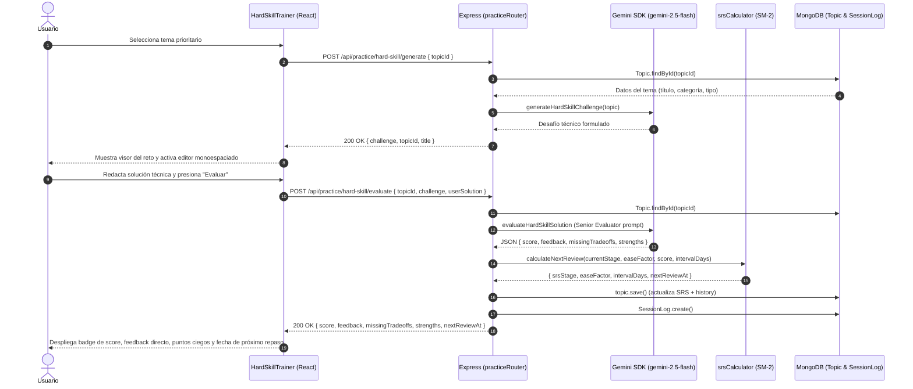
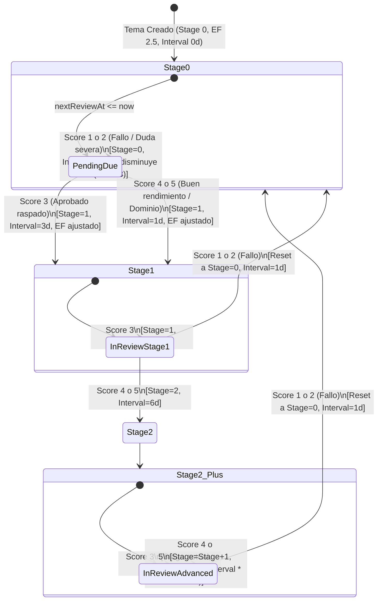
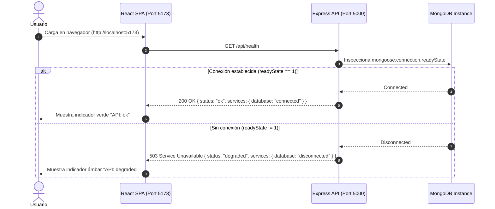

# Arquitectura Técnica del Sistema: DevCoach Sparring

Este documento describe la arquitectura modular, contratos de API, estrategia de persistencia y flujo de datos de DevCoach Sparring conforme avanza su grafo de desarrollo.

---

## 1. Topología del Monorepo

El repositorio está organizado como un monorepo NPM con separación estricta de responsabilidades:

```text
devcoach-sparring/
├── client/                     # Frontend SPA en Vite + React 18 + Tailwind CSS
│   ├── src/
│   │   ├── App.jsx             # Shell principal con monitoreo de API
│   │   ├── main.jsx            # Entry point
│   │   └── index.css           # Estilos base y tokens Tailwind
│   ├── index.html
│   ├── vite.config.js
│   └── package.json
├── server/                     # Backend API en Node.js + Express + Mongoose
│   ├── src/
│   │   ├── app.js              # Configuración de Express, middlewares y rutas
│   │   ├── server.js           # Bootstrap del servidor HTTP y conexión DB
│   │   ├── db.js               # Conexión defensiva a MongoDB
│   │   └── routes/
│   │       └── health.js       # Endpoint de diagnóstico y salud
│   ├── tests/
│   │   └── health.test.js      # Pruebas de integración con Supertest & MongoMemoryServer
│   └── package.json
├── tests/
│   └── e2e/
│       └── smoke.spec.js       # Validación End-to-End con Playwright
├── docs/                       # Documentación técnica y guías
├── tickets/                    # Registro formal de historias de usuario y evidencias
├── playwright.config.js        # Orquestación de webServer y navegadores E2E
└── package.json                # Workspaces de NPM y scripts concurrentes
```

---

## 2. Contratos de API

### 2.1 `GET /api/health`

Comprueba el estado del servidor y la conectividad activa con MongoDB.

- **Método:** `GET`
- **Ruta:** `/api/health`
- **Headers:** `Accept: application/json`

#### Códigos de Respuesta

| Código HTTP | Escenario | Payload de Ejemplo |
| :--- | :--- | :--- |
| `200 OK` | Servidor en línea y MongoDB conectado | `{"status": "ok", "timestamp": "2026-10-01T02:50:00.000Z", "services": {"database": "connected"}}` |
| `503 Service Unavailable` | Servidor en línea pero MongoDB desconectado / inalcanzable | `{"status": "degraded", "timestamp": "2026-10-01T02:50:00.000Z", "services": {"database": "disconnected"}}` |

### 2.2 `GET /api/topics/due`

Obtiene la cola de temas vencidos para repetición espaciada (`nextReviewAt <= Date.now()`), priorizando los temas más críticos (menor promedio histórico de score) y con mayor atraso temporal.

- **Método:** `GET`
- **Ruta:** `/api/topics/due`
- **Headers:** `Accept: application/json`

#### Códigos de Respuesta

| Código HTTP | Escenario | Payload de Ejemplo |
| :--- | :--- | :--- |
| `200 OK` | Consulta exitosa (array de temas) | `[{"_id": "...", "title": "React Fiber", "category": "hard_skill", "type": "theory", "srsStage": 0, "nextReviewAt": "..."}]` |
| `500 Internal Server Error` | Fallo de base de datos | `{"error": "Internal Server Error"}` |

### 2.3 `POST /api/topics/review`

Registra el resultado de una sesión de Active Recall o defensa por voz, recomputa el estado SRS con SM-2 adaptado y persiste el intento en el historial.

- **Método:** `POST`
- **Ruta:** `/api/topics/review`
- **Headers:** `Content-Type: application/json`
- **Body:**
  ```json
  {
    "topicId": "651f8...",
    "score": 4,
    "userInput": "Explicación de Fiber reconciler...",
    "aiFeedback": "Buena argumentación técnica."
  }
  ```

#### Códigos de Respuesta

| Código HTTP | Escenario | Payload de Ejemplo |
| :--- | :--- | :--- |
### 2.4 `POST /api/practice/hard-skill/generate`

Recibe un `topicId`, consulta el tema en MongoDB y formula un reto de Active Recall conceptual o práctico con `@google/genai` (`gemini-2.5-flash`).

- **Método:** `POST`
- **Ruta:** `/api/practice/hard-skill/generate`
- **Headers:** `Content-Type: application/json`
- **Body:**
  ```json
  {
    "topicId": "674c11112222333344445555"
  }
  ```

#### Códigos de Respuesta

| Código HTTP | Escenario | Payload de Ejemplo |
| :--- | :--- | :--- |
| `200 OK` | Reto generado exitosamente | `{"topicId": "...", "title": "Node.js Event Loop", "type": "theory", "category": "hard_skill", "challenge": "¿Cómo previene Node.js el thread starvation en la fase poll...?"}` |
| `400 Bad Request` | Falta `topicId` | `{"error": "topicId is required"}` |
| `404 Not Found` | Topic inexistente | `{"error": "Topic not found"}` |
| `500 Internal Server Error` | Error al invocar IA o BD | `{"error": "Internal Server Error"}` |

### 2.5 `POST /api/practice/hard-skill/evaluate`

Recibe la solución técnica del usuario, la evalúa con un prompt estricto de Senior Evaluator usando Gemini (`gemini-2.5-flash`), actualiza el estado SRS del `Topic` y guarda un registro en `SessionLog`.

- **Método:** `POST`
- **Ruta:** `/api/practice/hard-skill/evaluate`
- **Headers:** `Content-Type: application/json`
- **Body:**
  ```json
  {
    "topicId": "674c11112222333344445555",
    "challenge": "¿Cómo previene Node.js el thread starvation en la fase poll...?",
    "userSolution": "process.nextTick se drena al terminar la operación actual antes de la siguiente fase..."
  }
  ```

#### Códigos de Respuesta

| Código HTTP | Escenario | Payload de Ejemplo |
| :--- | :--- | :--- |
| `200 OK` | Evaluación procesada exitosamente | `{"score": 5, "feedback": "Excelente dominio...", "missingTradeoffs": ["..."], "strengths": ["..."], "nextReviewAt": "2026-10-02T...", "srsStage": 1, "intervalDays": 1, "sessionLogId": "..."}` |
| `400 Bad Request` | Faltan campos requeridos | `{"error": "topicId, challenge, and userSolution are required"}` |
| `404 Not Found` | Topic inexistente | `{"error": "Topic not found"}` |
| `500 Internal Server Error` | Error en evaluación o BD | `{"error": "Internal Server Error"}` |

---


## 3. Modelo de Datos (Mongoose Schemas)

### Modelo `Topic` (`server/src/models/Topic.js`)

```typescript
interface IReviewHistory {
  score: number;          // 1 a 5
  userInput: string;      // Respuesta o transcripción del usuario
  aiFeedback: string;     // Feedback emitido por Gemini
  reviewedAt: Date;       // Timestamp del repaso
}

interface ITopic {
  title: string;
  category: 'hard_skill' | 'soft_skill';
  type: 'theory' | 'practice';
  srsStage: number;       // Etapa SRS (0: nuevo/reseteado, 1, 2, ...)
  easeFactor: number;     // Multiplicador de dificultad (default: 2.5, min: 1.3)
  intervalDays: number;   // Días hasta el próximo repaso
  nextReviewAt: Date;     // Fecha programada para la siguiente revisión (Indexado)
  history: IReviewHistory[]; // Subdocumentos embebidos
  createdAt: Date;
  updatedAt: Date;
}
```

### Modelo `SessionLog` (`server/src/models/SessionLog.js`)

```typescript
interface ISessionLog {
  topicId: ObjectId;      // Referencia a Topic
  challenge: string;      // Enunciado generado por IA
  userSolution: string;   // Solución técnica del usuario
  score: number;          // Calificación asignada (1 a 5)
  feedback: string;       // Dictamen técnico del Senior Evaluator
  missingTradeoffs: string[]; // Puntos ciegos o trade-offs no considerados
  strengths: string[];    // Fortalezas técnicas identificadas
  reviewedAt: Date;
  createdAt: Date;
  updatedAt: Date;
}
```

---

## 4. Diagramas de Flujo y Arquitectura

### 4.1 Flujo de Active Recall y Evaluación de Hard Skills (Gemini + SRS)




### 4.2 Máquina de Estados del Motor Algorítmico SRS (SM-2 Adaptado)



### 4.3 Flujo de Arranque y Healthcheck



### 4.4 Harness de Testing y E2E Playwright

```mermaid
graph TD
    A[npm test / npm run test:e2e] --> B[Vitest + Supertest]
    A --> C[Playwright Test Runner]

    subgraph "Backend Harness"
        B --> D[MongoMemoryServer (In-Memory Mongo)]
        B --> E[Express App (Supertest)]
    end

    subgraph "E2E Harness (Playwright)"
        C --> F[Orquesta webServer: server (port 5000)]
        C --> G[Orquesta webServer: client (port 5173)]
        C --> H[Chromium Browser Context]
        H --> G
        G --> F
    end
```

---

## 5. Evolución Hacia las Siguientes Historias

- **US-04:** Módulo Soft Skills (Sparring por Voz con Web Speech API y Gemini).
- **US-05:** Presentará la cola `/api/topics/due` en el Dashboard de React y enlazará las sesiones con `POST /api/topics/review`.
- **US-06:** Seed Senior del Roadmap y Validación E2E Total.

